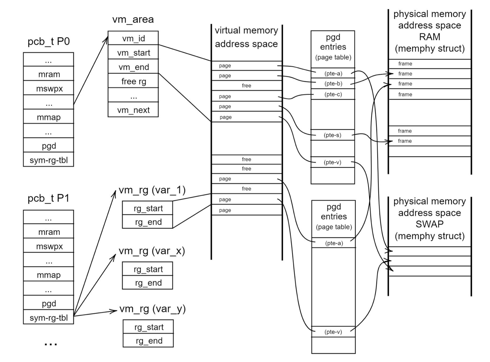

# Realtime Data Streaming | Data Engineering Project

## Introduction

The purpose of this major project is to simulate the main components of a simple operating system, such as a scheduler, synchronization, and activities related to physical and virtual memory.

## Operating System Architecture



The project is designed with the following components:

- **Scheduler applied Multi-Level Queue:** scheduler will be implemented by using priority policy.
- **Memory Management:** Implementing the `ALLOC`, `FREE` and `READ/WRITE` instruction in OS.

## Learning Outcomes
Through this project, I am aiming to practice three main parts: the scheduler, synchronization, and the mechanism for allocating virtual memory to physical memory.

## Testing

1. Testing scheduler:
Before testing, we will enable two macros `#MLQ_SCHED` and `#MM_FIXED_MEMSZ` for this scheduling test section and then compile our code by the command instruction in the terminal:

```bash
make clean 
make all
```
Run the test by simply type the following command in the terminal:

```bash
./os sched_0
./os sched_1
```

2. Testing memory management:
Before testing, we will disable macro `#MM_FIXED_MEMSZ` for this memory test section, since the size of RAM is not fixed any longer but can be varied in real life. And then compile our code by the command instruction in the terminal:

```bash
make clean
make all
```

We have create a new test case only for this memory test section, we will allow one CPU and will print out the RAM status to see the operation of the memory management. Then similarly, run the test by simply type the following command in the terminal:

```bash
./os os_new
```

3. Linking up together for Synchronization testing:
Now, we combine scheduler and memory management to form a complete OS. For simplicity, we will only use 1 virtual memory area in this assignment. We can test serveral cases for our OS operation to finalized our operating systems:

```bash
./os os_0_mlq_paging
```
    
or

```bash
./os os_1_mlq_paging
```

## Additional content
For further detail, you can find in this [report](./assignment_group35_report.pdf).